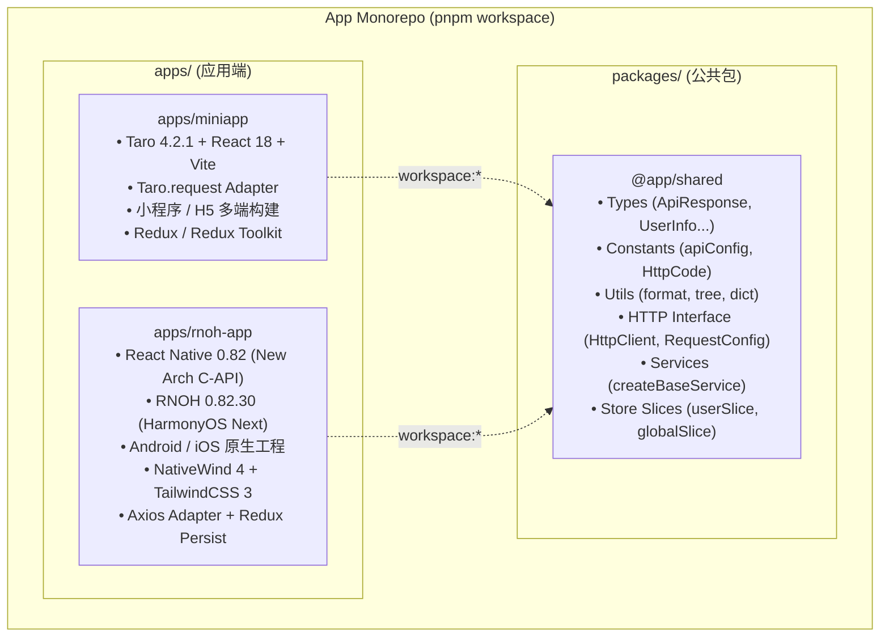

# App Monorepo

> **一库多端，逻辑共享** —— 覆盖「微信小程序 / H5」与「iOS / Android / HarmonyOS 鸿蒙跨端」的企业级多端单体仓库（Monorepo）。

---

## 目录

- [一、项目背景与架构愿景](#一项目背景与架构愿景)
- [二、Monorepo 整体架构图](#二monorepo-整体架构图)
- [三、工作区与子项目介绍](#三工作区与子项目介绍)
  - [1. apps/miniapp (小程序 / H5)](#1-appsminiapp-小程序--h5)
  - [2. apps/rnoh-app (HarmonyOS / Android / iOS 跨端 App)](#2-appsrnoh-app-harmonyos--android--ios-跨端-app)
  - [3. packages/shared (@app/shared 业务共享层)](#3-packagesshared-appshared-业务共享层)
- [四、跨端代码共享与分层设计原则](#四跨端代码共享与分层设计原则)
  - [1. 哪些共用，哪些隔离？](#1-哪些共用哪些隔离)
  - [2. 核心解耦模式：HttpClient 抽象与适配器](#2-核心解耦模式httpclient-抽象与适配器)
  - [3. 统一状态管理与业务契约](#3-统一状态管理与业务契约)
- [五、技术栈矩阵](#五技术栈矩阵)
- [六、常用命令与开发工作流](#六常用命令与开发工作流)
  - [1. 依赖安装](#1-依赖安装)
  - [2. 启动开发](#2-启动开发)
  - [3. 编译打包](#3-编译打包)
  - [4. HarmonyOS 专用构建](#4-harmonyos-专用构建)
- [七、代码规范与提交约定](#七代码规范与提交约定)

---

## 一、项目背景与架构愿景

在移动端全渠道覆盖的业务场景下，通常面临以下痛点：
1. **平台分散**：业务需要同时触达「微信小程序/H5 裂变获客」与「原生跨端 App（覆盖 iOS、Android 及 HarmonyOS Next 纯血鸿蒙）」两类场景。
2. **逻辑重复**：多端对接同一套后端 API 接口，若各自维护数据契约、API 封装、工具函数与状态流，会导致多倍开发工作量与数据同步偏差。
3. **UI 差异大**：小程序生态与 React Native 原生渲染机制不同，盲目追求一套 UI 代码通吃往往带来性能与体验妥协。

**本项目的核心解法：**
采用 **pnpm workspace** 单体仓库架构，实施 **「UI 各自为政，业务下沉共享」** 的分层设计。

```
                       ┌──────────────────────────────────────┐
                       │           后端服务 / REST API         │
                       └──────────────────┬───────────────────┘
                                          │
                                          ▼
                       ┌──────────────────────────────────────┐
                       │       packages/shared 业务核心层       │
                       │ (契约Types / 常量 / 纯工具 / API服务)   │
                       └───────────┬──────────────┬───────────┘
                                   │              │
                    (HttpClient 适配)            (HttpClient 适配)
                                   │              │
                                   ▼              ▼
         ┌───────────────────────────┐          ┌───────────────────────────┐
         │       apps/miniapp        │          │       apps/rnoh-app       │
         │   Taro 4 + React + Sass   │          │  RN 0.82 + RNOH + NativeWind │
         ├───────────────────────────┤          ├───────────────────────────┤
         │   微信小程序 / H5 / 字节    │          │  HarmonyOS / Android / iOS│
         └───────────────────────────┘          └───────────────────────────┘
```

---

## 二、Monorepo 整体架构图



---

## 三、工作区与子项目介绍

### 1. `apps/miniapp` (小程序 / H5)
- **定位**：轻量级多端小程序及移动端 Web 应用。
- **技术栈**：
  - [Taro 4.2.1](https://taro-docs.jd.com/) + React 18
  - 构建引擎：Vite Runner / Babel
  - 样式：Sass / SCSS
  - 状态：Redux / React-Redux / Redux-Thunk
- **支持端**：微信小程序 (`weapp`)、H5 (`h5`)、抖音/头条 (`tt`)、支付宝 (`alipay`)、百度 (`swan`)、京东 (`jd`)、QQ 小程序 (`qq`) 等。

### 2. `apps/rnoh-app` (HarmonyOS / Android / iOS 跨端 App)
- **定位**：高性能企业级跨端原生应用脚手架（基于新架构 C-API）。
- **技术栈**：
  - **核心内核**：React Native `0.82.1`（New Architecture）+ `@react-native-oh/react-native-harmony` `0.82.30`
  - **鸿蒙适配**：全套 `@react-native-ohos/*` 系列官方三方库适配（Gesture Handler, Reanimated 4, Safe Area, Webview, FS, File Viewer 等）
  - **UI 与样式**：Ant Design Mobile RN 5.x + NativeWind 4 / TailwindCSS 3 + `react-native-css-interop`
  - **路由导航**：React Navigation 7.x（Native Stack + Bottom Tabs + Harmony JS Stack 适配）
  - **状态持久化**：Redux Toolkit + Redux Persist + AsyncStorage
  - **高性能列表**：Shopify FlashList
  - **工程化脚本**：`patch-package` 三方库补丁管理、`scripts/repack-ohos-hars.sh` HAR 包重打包工具、Harmony C++ codegen

### 3. `packages/shared` (`@app/shared` 业务共享层)
- **定位**：**零平台依赖（Pure TypeScript）** 的底层业务抽象与数据层。
- **核心模块**：
  - `src/types/`：API 响应包装 `ApiResponse<T>`、分页契约 `PaginatedResponse<T>`、用户与登录实体等。
  - `src/constants/`：API 基础地址、超时配置、HTTP 状态码、全局字典常量。
  - `src/utils/`：时间日期格式化 (`formatDate`, `formatRelativeTime`)、树形结构处理 (`tree.ts`)、字典转换 (`dict.ts`) 等纯函数。
  - `src/http/`：平台无关的 `HttpClient` 契约抽象接口。
  - `src/services/`：基于工厂函数 `createBaseService(http)` 注入的业务 API 请求封装。
  - `src/store/slices/`：Redux Toolkit 切片（`userSlice`、`globalSlice`），规范跨端数据状态模型。

---

## 四、跨端代码共享与分层设计原则

### 1. 哪些共用，哪些隔离？

| 分类 | 共享层 (`@app/shared`) | 各应用端 (`apps/*`) |
| :--- | :--- | :--- |
| **API 与契约** | ✅ TypeScript 接口、请求/响应类型定义 | ❌ 仅消费类型 |
| **网络层** | ✅ 抽象 `HttpClient` 接口、BaseService 工厂 | ❌ 平台特有实现 (`Taro.request` / `axios`) |
| **工具函数** | ✅ 纯函数（时间、字符串、树结构、算法） | ❌ 依赖平台 API 的工具（设备信息、文件路径等） |
| **状态流** | ✅ Redux Toolkit Slices、Reducers 逻辑 | ❌ Store 挂载、持久化中间件配置 |
| **UI 与页面** | ❌ 严禁放入 | ✅ 各端原生组件（Taro `View` / RN `<View>`） |
| **路由导航** | ❌ 严禁放入 | ✅ 各端专属导航（Taro 页面栈 / React Navigation） |

### 2. 核心解耦模式：HttpClient 抽象与适配器

`packages/shared` 定义通用请求接口，不捆绑具体网络库：

```typescript
// packages/shared/src/http/types.ts
export interface HttpClient {
  get<T>(path: string, config?: RequestConfig): Promise<ApiResponse<T>>
  post<T>(path: string, body?: unknown, config?: RequestConfig): Promise<ApiResponse<T>>
  put<T>(path: string, body?: unknown, config?: RequestConfig): Promise<ApiResponse<T>>
  delete<T>(path: string, config?: RequestConfig): Promise<ApiResponse<T>>
}
```

业务服务使用工厂模式挂载：

```typescript
// packages/shared/src/services/baseService.ts
export function createBaseService(http: HttpClient) {
  return {
    uploadFile: (formData: FormData) =>
      http.post<UploadResult>('/file/upload', formData),
    getLastAppVersion: (config?) =>
      http.post<AppVersion>('/sys/versionApp/getLastAppVersion', undefined, config),
  }
}
```

各应用端只需实现简易 Adapter：
- **`apps/miniapp`**：封装 `Taro.request`，生成符合 `HttpClient` 的实例。
- **`apps/rnoh-app`**：包装现有的 Axios `apiClient` 实例。

### 3. 统一状态管理与业务契约

各端 `package.json` 通过 workspace 协议引入共享包：
```json
{
  "dependencies": {
    "@app/shared": "workspace:*"
  }
}
```
直接在页面/组件中无缝导入：
```typescript
import type { ApiResponse, UserInfo } from '@app/shared'
import { formatDate } from '@app/shared'
import { createBaseService } from '@app/shared'
```

---

## 五、技术栈矩阵

| 维度 | `apps/miniapp` | `apps/rnoh-app` | `packages/shared` |
| :--- | :--- | :--- | :--- |
| **平台覆盖** | 微信/抖音/支付宝小程序、H5 | HarmonyOS Next、Android、iOS | 跨平台通用 (Node/Browser/Native) |
| **框架核心** | Taro 4.2.1 (React 18) | React Native 0.82.1 (React 19) | TypeScript 5.x |
| **鸿蒙底座** | - | RNOH 0.82.30 (C-API Architecture) | - |
| **UI 组件库** | Taro Components | Ant Design Mobile RN 5.x | - |
| **样式引擎** | Sass / SCSS | NativeWind 4 + TailwindCSS 3.4 | - |
| **状态管理** | Redux / React-Redux | Redux Toolkit + Redux Persist | Redux Toolkit Slices |
| **网络底层** | Taro.request (适配 HttpClient) | Axios + 拦截器 (适配 HttpClient) | 抽象 HttpClient 接口 |
| **代码检查** | ESLint + Stylelint | ESLint + Prettier + Commitlint | TypeScript Strict Check |

---

## 六、常用命令与开发工作流

### 1. 依赖安装
本项目使用 **pnpm 10+** 进行 workspace 统一管理：

```bash
# 根目录下安装所有子应用及共享包依赖
pnpm install
```

> **提示**：安装后会自动触发 `apps/rnoh-app` 的 `postinstall` 脚本（执行 `patch-package` 和 `repack-ohos-hars.sh`）。

### 2. 启动开发

```bash
# 微信小程序开发模式 (带热重载与文件监听)
pnpm dev:miniapp

# H5 开发模式
pnpm dev:h5

# 启动 React Native Metro 服务
pnpm dev:rnoh
```

也可以直接进入子目录执行对应命令：
```bash
# 在 apps/miniapp 下启动抖音/字节小程序
cd apps/miniapp && npm run dev:tt

# 在 apps/rnoh-app 下启动 Android
cd apps/rnoh-app && npm run android

# 在 apps/rnoh-app 下启动 iOS
cd apps/rnoh-app && npm run ios
```

### 3. 编译打包

```bash
# 构建微信小程序生产产物 (输出至 apps/miniapp/dist)
pnpm build:miniapp

# 构建 H5 生产产物
pnpm build:h5
```

### 4. HarmonyOS 专用构建

开发与调试鸿蒙原生工程需要配合 **DevEco Studio**：

```bash
# 1. 进入鸿蒙 entry 目录安装 OHPM 依赖
cd apps/rnoh-app/harmony/entry && ohpm install

# 2. 回到 rnoh-app 目录生成 C++ / RNOH 桥接代码
cd ../..
npm run codegen

# 3. 构建鸿蒙 bundle
npm run dev

# 4. 在 DevEco Studio 中打开 apps/rnoh-app/harmony 目录，连接设备或模拟器运行
```

---

## 七、代码规范与提交约定

本项目使用 **[Conventional Commits](https://www.conventionalcommits.org/)** 规范，提交信息由 Husky + Commitlint 统一强校验。

### 提交格式
```bash
<type>(<scope>): <subject>
```

### Type 类型对照表
- `feat`: 新增功能特性
- `fix`: 修复问题或 Bug
- `docs`: 文档相关修改
- `style`: 代码格式调整（不影响运行逻辑）
- `refactor`: 代码重构（非新增功能也非修复）
- `perf`: 性能优化
- `test`: 单元测试与集成测试相关
- `build`: 构建系统、依赖更新或工作区配置修改
- `ci`: CI/CD 流程脚本与配置
- `chore`: 构建过程或辅助工具变动
- `revert`: 回退历史提交

### 提交示例
```bash
git commit -m "feat(shared): add dictionary tree converter utility"
git commit -m "fix(miniapp): resolve Taro.request header token missing"
git commit -m "docs: update monorepo architecture and build guides"
```

---

## 八、目录速查清单

```
app-monorepo/
├── apps/
│   ├── miniapp/                   # Taro 4 跨端小程序 / H5 工程
│   │   ├── config/                # Taro 编译与 Vite 配置文件
│   │   ├── src/                   # 小程序源码 (pages, components, store)
│   │   └── package.json           # 依赖 @app/shared
│   └── rnoh-app/                  # React Native + RNOH 跨端原生工程
│       ├── android/               # Android 原生工程
│       ├── ios/                   # iOS 原生工程
│       ├── harmony/               # OpenHarmony / HarmonyOS 原生工程
│       ├── patches/               # patch-package 补丁文件
│       ├── scripts/               # 鸿蒙 HAR 重打包等脚本
│       ├── src/                   # App 业务源码 (screens, navigation, theme)
│       └── package.json           # 依赖 @app/shared
├── packages/
│   └── shared/                    # 零平台依赖的公共逻辑与业务层
│       ├── src/
│       │   ├── types/             # 统一类型定义与 API 模型
│       │   ├── constants/         # 全局业务常量与 API 配置
│       │   ├── utils/             # 纯函数工具库
│       │   ├── http/              # HttpClient 抽象契约
│       │   ├── services/          # 业务 API 工厂服务
│       │   └── store/             # Redux Toolkit Slices
│       └── package.json           # @app/shared
├── package.json                   # 根项目 Scripts 与工程配置
├── pnpm-workspace.yaml            # pnpm workspace 定义
├── pnpm-lock.yaml                 # 统一依赖锁定文件
└── README.md                      # 本说明文档
```
