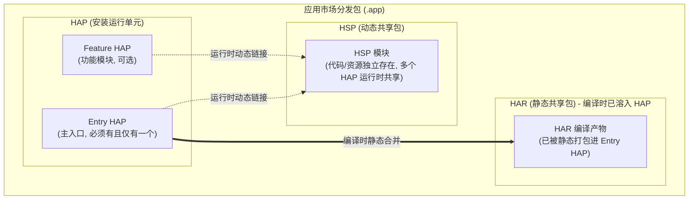
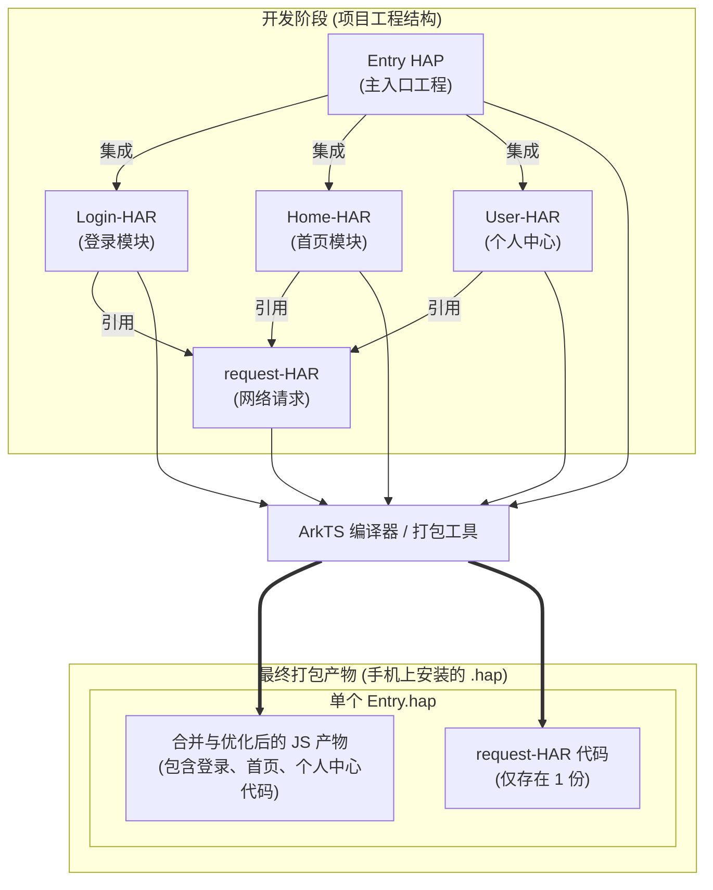
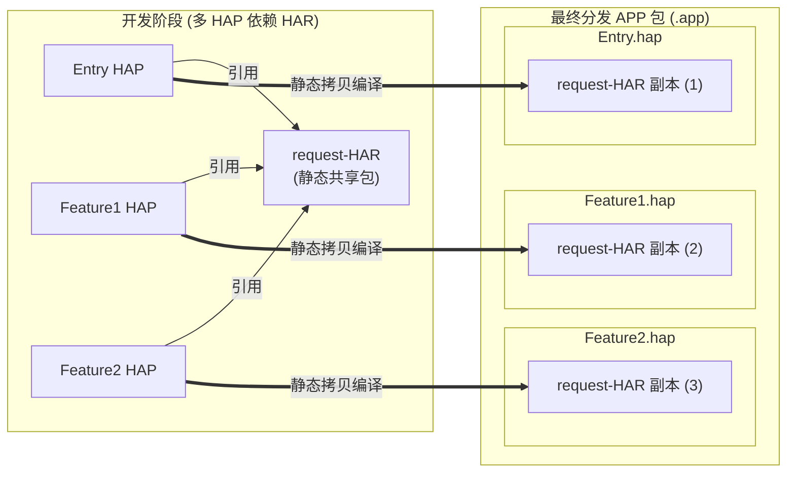
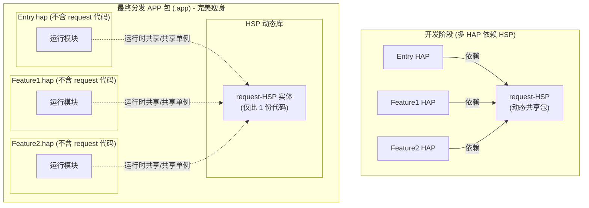
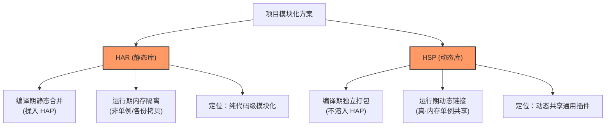

# 鸿蒙 HAP、HAR、HSP 概念与打包机制图解

本指南通过直观的图解，帮助你理解 HarmonyOS 中 HAP、HAR 和 HSP 的核心概念，以及它们在不同打包场景下的差异。

---

## 1. 核心概念对比图

我们先来看看这三种包在应用（APP）中的位置和关系：



- **HAP**：就像是一个独立的**集装箱**，可以直接安装在设备上运行。
- **HAR**：就像是**散装的砖木**，编译时会被打包进集装箱（HAP）里，无法独立安装。
- **HSP**：就像是一个**公共服务站**，它在集装箱外独立存在，多个集装箱（HAP）在运行时都可以找它服务。

---

## 2. 场景 A：单 HAP 架构（最常见）

如果你的 App **只有一个 Entry HAP**，无论你把登录、首页、个人中心拆分成多少个 HAR，最终的打包合并过程如下：



> [!NOTE] > **结论**：在**单 HAP** 架构下，即使三个页面模块都引用了 `request-HAR`，打包工具在构建这唯一的 HAP 时，会把所有的 JS/TS 代码进行优化合并，`request-HAR` **在最终的 HAP 里只会被打包一份**，不会有冗余。

---

## 3. 场景 B：多 HAP 架构（使用 HAR）

如果你的应用拆分了多个 HAP（例如一个 Entry HAP，多个 Feature HAP），并且它们都依赖了静态共享包 `request-HAR`：



> [!WARNING] > **结论**：因为 HAR 是**静态**编译的，每个 HAP 在打包时都会拷贝一份 `request-HAR` 的代码。这会导致最终的包里有 **3 份** 重复的 `request-HAR` 代码，造成包体积浪费。

---

## 4. 场景 B 优化：多 HAP 架构（使用 HSP）

为了解决多 HAP 架构下 HAR 导致的代码重复问题，我们可以把 `request-HAR` 替换成 **HSP (动态共享包)**：



> [!TIP] > **结论**：转换为 HSP 后，`request` 的代码在 APP 安装包里**只保留了一份**。在运行时，所有的 HAP 会动态去链接和调用这个共享的 HSP。这样不仅节省了空间，还能保证网络请求模块在全局是一个**真正的单例**（共享同一个内存上下文、同一个 cookie/token 存储等）。

---

## 5. HSP 的提供者与依赖配置实战（以本项目为例）

### 5.1 HSP 是谁“提供”的？

**结论**：HSP 是你自己的应用内部自带并提供的，由手机上的**鸿蒙系统在运行时负责加载**。

1. **打包与安装**：在打包生成最终交付的 `.app` 包时，编译工具会将 `entry.hap` 与 `request_hsp.hsp` 一起打包入内。用户安装 App 时，这两个包会**同时安装到本地沙箱中**。
2. **加载与链接**：当 HAP 运行到需要调用 `request_hsp` 的代码时，系统的 **ArkCompiler 运行期**会动态把 `.hsp` 文件载入内存。所有关联的 HAP 均链接至此同一块内存中，实现数据和逻辑的共享。

---

### 5.2 如何在项目中进行配置？

以当前 [SAMRApp](file:///Users/dylan/CodeHub/SAMRApp) 工程的 `harmony` 目录结构为例，配置 HSP 依赖仅需 4 步：

#### 步骤 1：新建 HSP 模块

在 DevEco Studio 中选择项目右键 `New -> Module -> Shared Library` (这就是 HSP 模块)，命名为 `request_hsp`。
生成的 `harmony/request_hsp/src/main/module.json5` 会自动标记为共享库类型：

```json5
{
  module: {
    name: 'request_hsp',
    type: 'shared', // 关键：声明这是一个 HSP (动态共享包)
    deliveryWithInstall: true,
    // ...
  },
}
```

#### 步骤 2：在全局配置文件中注册新模块

打开全局构建配置 [build-profile.json5](file:///Users/dylan/CodeHub/SAMRApp/harmony/build-profile.json5)，将新创建的模块注册至 `"modules"` 列表中：

```json5
  "modules": [
    {
      "name": "entry",
      "srcPath": "./entry",
      "targets": [
        {
          "name": "default",
          "applyToProducts": [
            "default"
          ]
        }
      ]
    },
    {
      "name": "request_hsp",
      "srcPath": "./request_hsp" // 注册你的 HSP 模块
    }
  ]
```

#### 步骤 3：在 HAP 中关联依赖 HSP

打开你的主模块的包配置文件 `harmony/entry/oh-package.json5`，在 `"dependencies"` 中添加该 HSP 的本地路径引用：

```json5
{
  name: 'entry',
  version: '1.0.0',
  dependencies: {
    request_hsp: 'file:../request_hsp', // 指向本地的 HSP 目录
  },
}
```

#### 步骤 4：在代码中使用

现在，你可以在 `entry` HAP 的代码中像使用普通三方库一样引用并使用它了：

```typescript
import {request} from 'request_hsp';

// 发起网络请求，所有导入此模块的页面都会共享同一份内存和单例
request.post('/api/login', credentials);
```

---

## 6. 思考：为什么我们需要多 HAP 架构？（单 HAP 与多 HAP 选型建议）

**核心观点**：对于 95% 以上的普通项目，**单 HAP (Entry HAP) 架构完全足够了**。过早引入多 HAP 只会徒增签名配置、编译时间和版本管理的复杂度。

然而，在面对以下特定的**高级或巨型业务场景**时，鸿蒙官方设计的多 HAP 架构能够发挥巨大威力：

### 6.1 适用多 HAP 架构的 4 大典型场景

1. **超大型应用的“按需加载 / 动态瘦身”**

   - **痛点**：应用体积过大（如数百 MB ），首发下载体验差。
   - **方案**：将主功能放在唯一的 `Entry HAP`，将非核心的独立业务模块（如金融理财、医疗咨询等）拆分为独立的 `Feature HAP`。配置为“按需下载”（On-demand），用户在 App 内点击该功能时系统才会在后台下载对应的 HAP 动态载入。

2. **鸿蒙“元服务”（免安装应用体验）**

   - **痛点**：元服务有极高的包体积限制（如必须小于 10MB ），实现扫码即开、即用即走。
   - **方案**：需要将元服务功能单独划分为独立的 HAP（或者是元服务 HAP），以便在华为生态内独立分发。

3. **跨多物理设备适配（手表、车载、智慧屏）**

   - **痛点**：手表、车载设备的屏幕尺寸、交互方式、甚至部分原生代码和手机完全不同。
   - **方案**：在同一个大项目工程下，针对手机开发 `entry_phone.hap`，针对手表开发 `entry_watch.hap`。打包后统一打包进 `.app` 分发包中，应用商店会根据用户的设备类型，只下发对应设备的 HAP。

4. **巨型团队的“物理业务隔离”**
   - **痛点**：数百名研发团队同时开发一个 App，合并代码频繁冲突，测试和发布流程极其臃肿。
   - **方案**：每个子业务团队负责开发自己的 `Feature HAP`，各个 HAP 在物理上完全隔离，各团队可以独立进行编译、本地真机测试和包发布。

---

### 6.2 选型总结与建议

| 架构类型              | 适用项目规模                         | 业务特征                                                               | 推荐选型建议                                                                                          |
| :-------------------- | :----------------------------------- | :--------------------------------------------------------------------- | :---------------------------------------------------------------------------------------------------- |
| **单 HAP 架构**       | 个人、中小企业、绝大多数普通商业项目 | 业务集中在手机端、功能常规、代码量百万行以内。                         | **老老实实选择单 HAP**。<br>在单 HAP 内部，使用本地文件夹或静态共享库 (HAR) 进行代码分层解耦即可。    |
| **多 HAP + HSP 架构** | 巨型 App、元服务、多端适配、大厂团队 | 包含大量非高频巨型子业务、需要支持手表等跨端、或必须支持免安装元服务。 | **引入多 HAP 架构**。<br>并在公共底层模块（如网络、工具类、底层 UI）使用 **HSP** 以避免代码重复拷贝。 |

---

## 7. 深入解析：HAR 与 HSP 的本质区别与通俗比喻

当我们决定在项目中将功能（如首页、市场监管、我的）拆分为独立的共享包时，必须理清它们底层逻辑的根本差异。

### 7.1 HAR 的本质：纯粹的“模块化 (Modularization)”

**HAR (Harmony Archive)** 类似于 Android 的 AAR、Java 的 JAR，或者是前端的本地 npm 包。它解决了 **“开发阶段代码管理”** 的痛点：

- **开发时**：代码物理隔离在不同的模块目录下，首页、市场监管和我的各不相干，便于多人协作，保持低耦合。
- **编译时**：打包工具会将这些 HAR 的代码“拆散”，**静态地合并入依赖它们的主包 (HAP) 中**。
- **运行时**：并不存在独立的 HAR 实质，它已经完全融入了 HAP。

> [!WARNING] > **关于“分包”概念的纠正**：
> HAR 只是**开发及编译期**的物理分包。它**绝对无法**实现类似微信小程序的“动态下载/按需下载”（运行期分包）功能。

---

### 7.2 HSP 的本质：单实例的“动态链接库/通用插件”

**HSP (Harmony Shared Package)** 类似于 Windows 中的 `.dll`，或者 Linux/Android 中的 `.so` 动态链接库。

它最大的特点是 **“运行时动态链接”**，并在内存中具有 **“单实例 (Singleton) 共享”** 特性：

- **内存单实例共享**：
  - **如果是 HAR**：你的 `Entry HAP` 和 `Feature HAP` 各自编译拷贝了一份 `request-HAR`。在运行时，它们在内存里是**完全隔离的两个实例**。如果在主页面登录并把全局 Token 存在了网络请求类里，副页面发送请求时是**拿不到**这个 Token 的（因为它是另一份内存里的独立对象）。
  - **如果是 HSP**：系统在内存中**只会加载一次**这个 HSP。无论哪个 HAP 模块调用它，访问的都是**同一个内存地址**，Token 在全局能自然共享。
- **应用内共享**：HSP 代码独立存在于安装后的沙箱中，服务于同一个应用包下的所有 HAP，避免了内存与磁盘空间的重复占用。

---

### 7.3 形象比喻：压缩饼干 vs 公共食堂

为了更容易给团队其他成员解释，你可以使用以下比喻：

- **HAR（静态库） ＝ 压缩饼干**
  每个集装箱（HAP）里都各塞一块。虽然大家吃的是同一种饼干（代码相同），但独立存在。你在你的箱子里把饼干啃了一口（改变了状态/变量），我箱子里的饼干**并不会**有任何变化。
- **HSP（动态库） ＝ 公共食堂**
  食堂建在所有集装箱（HAP）的外面。不管是哪个箱子里的人肚子饿了，都要**走出箱子**来到这同一个食堂里吃饭。大家吃的是同一锅饭，状态全局共享。

---

### 7.4 归纳脑图



---

## 8. 常见疑问：模块化拆分对 Android / iOS 多端适配有影响吗？

在 **React Native 跨平台开发** 中，如果对业务页面（例如 4 个 Tab 页面）进行模块化拆分，其对多端（Android, iOS, 鸿蒙）的影响取决于你拆分的**层级**。

### 8.1 情况 A：在 JS/TS 层进行拆分（推荐）

如果你将 Tab 页面写成纯 JS/TS 组件，并在项目根目录使用 `pnpm/yarn workspaces` 或 `lerna` 进行子包/工作区（Workspaces）拆分：

- **Android 和 iOS 完美兼容，没有任何负面影响。**
- **打包机制**：Android (`.apk`)、iOS (`.ipa`) 和鸿蒙 (`.hap`) 的 **Metro 打包器**非常智能，它会自动解析依赖解析关系，并在打包时将你本地子包的代码抽取并统一编译成各平台各自的单 JS bundle 文件。
- **Debug / 热更新**：完全正常运作。
- _注：你仅需在 `metro.config.js` 里配置 `watchFolders`，告诉 Metro 包含这些本地子包的物理路径即可。_

---

### 8.2 情况 B：在原生端进行拆分（不推荐）

如果你把 Tab 页面的核心逻辑使用原生语言（Java/Swift/ArkTS）重构，并在鸿蒙端打包成本地的 `.har` / `.hsp` 模块：

- **Android 和 iOS 无法直接识别。**
- **原因**：`HAR` / `HSP` 是鸿蒙独有的二进制/源码包打包机制，Android 的 Gradle 编译链和 iOS 的 Xcode/CocoaPods 链对它们完全无法识别。
- **代价**：如果某些页面必须使用原生实现，你必须针对三个平台**各自手写实现一遍**原生模块（如鸿蒙的 `har`、Android 的 `aar`/本地 Library、iOS 的 `Framework`/`Pod`），然后使用 React Native 的 **TurboModule** 或 **Fabric 原生组件**桥接机制在 JS 侧进行调用。这会显著增加开发和跨端对齐成本。

---

### 8.3 多端适配架构建议

针对你的 **React Native** 应用：

1.  **Tab 业务页面全面保持在 JS/TS 侧**。
2.  **若要解耦，仅在 JS 侧采用工作区（Monorepo Workspaces）方式**拆分为本地 package，避免多平台兼容性灾难。
