# 通用列表页指南

本文说明如何在 MARS App 中快速搭建「深色顶栏 + 搜索 + 多条件筛选 + 分页列表」页面。

## 架构概览

```mermaid
flowchart TB
  subgraph page [业务页面 如 DemoTodoList]
    Filters[useFilters]
    Paginated[usePaginatedList]
    ScrollFab[useScrollToTopFab]
    Layout[FilterListLayout]
  end
  Filters -->|filtersRef.current| Paginated
  Paginated --> Layout
  ScrollFab --> Layout
  Layout --> SearchBar
  Layout --> DaDropdown
  Layout --> FlatList
```



| 模块                                                                           | 职责                              |
| ------------------------------------------------------------------------------ | --------------------------------- |
| [`useFilters`](../../src/hooks/useFilters.ts)                                  | 筛选条件 State + 同步 Ref         |
| [`usePaginatedList`](../../src/hooks/usePaginatedList.ts)                      | 分页、刷新、错误态                |
| [`useScrollToTopFab`](../../src/hooks/useScrollToTopFab.ts)                    | 滚动超过半屏显示回顶 FAB          |
| [`FilterListLayout`](../../src/components/FilterListLayout/index.tsx)          | 统一布局壳（搜索 + 筛选 + 列表）  |
| [`FilterSlotPanel`](../../src/components/FilterListLayout/FilterSlotPanel.tsx) | Slot 内双 Picker + 重置/查询      |
| [`DarkSearchBar`](../../src/components/HeaderSearch/DarkSearchBar.tsx)         | 深色搜索框（含 Android 清除按钮） |

**参考实现**：[`src/screens/MarketReg/DemoTodoList.tsx`](../../src/screens/MarketReg/DemoTodoList.tsx)

## 新建列表页 Checklist

### 1. 定义类型与初始筛选

```typescript
type MyFilters = {
  keyword?: string;
  category?: string;
};

const INITIAL_FILTERS: MyFilters = {};
```

### 2. fetcher 使用 filtersRef

```typescript
const {filters, filtersRef, updateFilter, resetFilters, consumeResetSignal} =
  useFilters<MyFilters>(INITIAL_FILTERS);

const fetcher = useCallback(
  params => api({...params, keyword: filtersRef.current.keyword}),
  [filtersRef],
);
```

> 详见 [列表查询状态异步更新滞后问题](../issue/列表查询状态异步更新滞后问题.md)

### 3. 搜索交互

- **输入过程中（`onChange`）**：不 trim，原样更新 keyword
- **点「查询」或键盘提交**：`DarkSearchBar` 内对关键词 `trim()` 首尾空格后，再 `updateFilter` + `refresh()`；若 trim 前后不一致，会同步回输入框
- **清空**：`onChange` 中 `value.trim() === ''` 时立即 `refresh()`（含仅输入空格后删光、或点清除按钮）
- **中间空格保留**：如「食品 检查」查询时不会去掉词间空格

```typescript
// 业务页 onChange 只需：
const onSearchChange = useCallback(
  (value: string) => {
    updateFilter('keyword', value);
    if (value.trim() === '') {
      refresh();
    }
  },
  [updateFilter, refresh],
);

// onSubmit / onCancel（查询）收到的 value 已由 DarkSearchBar trim
const onSearchSubmit = useCallback(
  (value: string) => {
    updateFilter('keyword', value);
    refresh();
  },
  [updateFilter, refresh],
);
```

### 4. 使用 FilterListLayout

```tsx
<FilterListLayout
  search={{
    value: filters.keyword,
    placeholder: '请输入关键词',
    onChange: onSearchChange,
    onSubmit: onSearchSubmit,
    onCancel: onSearchCancel,
  }}
  dropdown={{
    menu,
    onMenuChange: setMenu,
    onConfirm: onDropdownConfirm,
    renderSlot1: renderSlot,
  }}
  list={{
    data,
    keyExtractor: item => item.id,
    renderItem,
    listRef,
    refreshing,
    loadingMore,
    hasMore,
    error,
    onRefresh: refresh, // 同时传给 DaDropdown.onRefresh，筛选「确定」后自动 refresh
    onLoadMore: loadMore,
    onScrollToTop: scrollToTop,
    scrollBind,
    scrollToTopFabVisible,
    emptyText: '暂无数据',
  }}
/>
```

### 5. Slot 更多筛选

使用 `FilterSlotPanel`，支持：

- 已选字段高亮（`selected: true` 时文字 `#333`）
- 「重置」：同步清空 Slot 内字段（`updateFilter`），**不** `refresh()`；可与其他 Tab 联动重置后再点「查询」
- 「重置全部筛选」：调用 `resetFilters()` 并恢复 `initialMenu`，同样不自动请求，需再点「查询」

```typescript
<FilterSlotPanel
  fields={[...]}
  onReset={() => {
    updateFilter('priority', undefined);
    updateFilter('source', undefined);
  }}
  onResetAll={() => {
    resetFilters();
    setMenu(initialMenu);
  }}
  onQuery={refresh}
/>
```

### 6. DaDropdown Slot 激活态

`slot1` 类型不会自动高亮，需根据筛选值手动同步：

```typescript
useEffect(() => {
  const active = !!(filters.priority || filters.source);
  setMenu(prev =>
    prev.map(item =>
      item.type === 'slot1' && item.prop === 'more'
        ? {...item, isActived: active}
        : item,
    ),
  );
}, [filters.priority, filters.source]);
```

### 7. 错误态

`usePaginatedList` 返回 `error`，`FilterListLayout` 在「无数据 + 非刷新中 + 有错误」时展示重试按钮。

Demo 页可通过搜索 `__error__` 模拟接口失败。

### 8. 列表项跳转

在 `renderItem` 的 `TouchableOpacity` 上绑定 `navigation.navigate(...)`，完成列表 → 详情闭环。

### 9. 重置信号（可选）

默认「草稿模式」下，`resetFilters()` **不会**自动 `refresh()`。仅在少数需要「重置后立刻拉数」的场景，显式传 `{ refresh: true }` 并配合 `consumeResetSignal`：

```typescript
const onResetAll = () => {
  resetFilters({refresh: true});
  setMenu(initialMenu);
};

useEffect(() => {
  if (consumeResetSignal()) {
    refresh();
  }
}, [filters, refresh, consumeResetSignal]);
```

常规 Slot / filter 面板请让用户点「查询」或「确定」后再 `refresh()`，无需上述 effect。

### 10. 导航栏与搜索区之间的白线

**现象**：系统导航标题下方、搜索框上方出现一条浅色/白色细线。

**原因**（通常同时存在）：

1. **背景色不一致**：子 Stack 导航栏使用 [`SUB_STACK_HEADER_BG`](../../src/theme/colors.ts)（`#171933`），若 `FilterListLayout` 顶栏仍用旧色 `#191B35`，两种深色交界处会像一条亮线。
2. **页面根背景透出**：布局根容器若为浅色（如 `#F6F9FF`），导航栏与内容区之间若有 1px 缝隙，会露出浅色底。
3. **系统顶栏默认阴影/边框**：iOS Native Stack 或鸿蒙 JS Stack 可能保留 `headerShadow` / `borderBottom`，在深色背景下呈细白线。

**约定与处理**：

| 位置                                  | 应使用的背景色                     |
| ------------------------------------- | ---------------------------------- |
| `defaultSubStackScreenOptions` 导航栏 | `SUB_STACK_HEADER_BG`（`#171933`） |
| `FilterListLayout` 根容器 + 顶栏      | 同上                               |
| `DaDropdown` 默认 `bgColor`           | 同上（已对齐）                     |

注册 Screen 时，建议为列表页设置 `contentStyle`，避免屏幕默认浅色从缝隙透出：

```tsx
import {SUB_STACK_HEADER_BG} from '@/theme/colors';

<Stack.Screen
  name="MyList"
  component={MyListScreen}
  options={{
    title: '列表标题',
    contentStyle: {backgroundColor: SUB_STACK_HEADER_BG},
  }}
/>;
```

全局导航栏已在 [`defaultSubStackScreenOptions.tsx`](../../src/navigation/defaultSubStackScreenOptions.tsx) 中设置 `headerShadowVisible: false`、`borderBottomWidth: 0`。新建列表页**不要**再单独把顶栏改成 `#191B35` 等其它色值。

> 子 Stack 顶栏全局约定见 [子页顶栏全局主题](./子页顶栏全局主题.md)。

### 11. Android 搜索框无清除按钮（×）

**现象**：输入关键词后，鸿蒙 / iOS 输入框右侧有系统清除「×」，Android 没有。

**原因**：`@ant-design/react-native` 的 `SearchBar` 内部对 `TextInput` 设置了 `clearButtonMode="always"`，该属性**仅 iOS 生效**；鸿蒙 RNOH 实现了类似行为，Android 不支持。

**处理**：通用列表页已封装 [`DarkSearchBar`](../../src/components/HeaderSearch/DarkSearchBar.tsx)，在 `Platform.OS === 'android'` 且有内容时，于输入框内、「查询」按钮左侧渲染自定义清除图标。`FilterListLayout` 已默认使用，无需业务页额外处理。

若业务页仍直接使用 antd `SearchBar`，请改为 `DarkSearchBar`，或自行在 Android 补清除逻辑。

### 12. DaDropdown 重置与回调机制

`filter`、`picker`、`daterange` 三类面板行为一致：

| 操作 | UI                 | 筛选状态                        | 列表请求                                                                     |
| ---- | ------------------ | ------------------------------- | ---------------------------------------------------------------------------- |
| 重置 | 清空当前面板选中态 | `onConfirm` 同步 `updateFilter` | 默认不 refresh、面板保持打开；`resetRefresh: true` 时 refresh **并收起面板** |
| 确定 | 关闭面板           | `onConfirm` 同步 `updateFilter` | `onRefresh()`                                                                |

业务页 **`onConfirm` 只负责改状态**，refresh 交给 `onRefresh`（约定必传，见 [`DaDropdownProps`](../../src/components/DaDropdown/types.ts)）：

```typescript
// FilterListLayout：list.onRefresh 会自动传给 DaDropdown，业务页只需在 onConfirm 里 updateFilter
const onDropdownConfirm = (payload: Record<string, unknown>) => {
  applyDropdownPayload(payload);
};

// 直接使用 DaDropdown 的页面：onConfirm + onRefresh 都要传，不要在 onConfirm 里 refresh()
<DaDropdown dropdownMenu={menu} onConfirm={onConfirm} onRefresh={refresh} />;
```

多条件联动：用户可在不同 Tab 分别点「重置」清掉对应字段，最后统一点某一 Tab 的「确定」或搜索框「查询」再发一次请求。

**某个 Tab 重置后立刻拉数并收起面板**：在该菜单项上设 `resetRefresh: true` 即可，**不用改 `onConfirm`**：

```typescript
{
  title: '状态',
  type: 'filter',
  prop: 'status',
  resetRefresh: true,
  options: [...],
}
```

**Slot 面板**：在 `onReset` / `onQuery` 里自行决定是否 `refresh()`。

**重置全部并立刻拉数**：`resetFilters({ refresh: true })` + `consumeResetSignal` effect（见 §9）。

重置载荷仍使用 `{ [prop]: {} }` 或 `{ [prop]: null }`，便于业务页用 `'prop' in payload` 识别要清空的字段。

## 相关文档

- [usePaginatedList Hook 指南](../hook/usePaginatedList.md)
- [useFilters Hook 指南](../hook/useFilters.md)
- [FlatList 性能优化指南](./FlatList性能优化指南.md)
- [子页顶栏全局主题](./子页顶栏全局主题.md)
- [深色 SearchBar 样式](../../src/components/HeaderSearch/darkSearchBarStyles.ts)

## 验证清单

- [ ] 搜索 → 查询 → 结果正确
- [ ] 清空搜索框 → 列表恢复
- [ ] 多条件筛选组合正确
- [ ] 下拉刷新、上拉加载、回顶 FAB
- [ ] 错误态 + 重试（Demo：`__error__`）
- [ ] 点击列表项进入详情
- [ ] 直接使用 DaDropdown 时已传 `onRefresh={refresh}`（FilterListLayout 页通过 `list.onRefresh` 即可）
- [ ] filter / Slot 重置后列表不变、筛选状态已清空，点确定或查询后再刷新
- [ ] `resetRefresh: true` 的 Tab 重置后立即 refresh 并收起面板
- [ ] 重置全部筛选恢复初始状态（需再点查询）
- [ ] 导航栏与搜索区无白线/色差接缝
- [ ] Android 输入后搜索框显示清除按钮（×）
- [ ] `npm run lint` 通过
