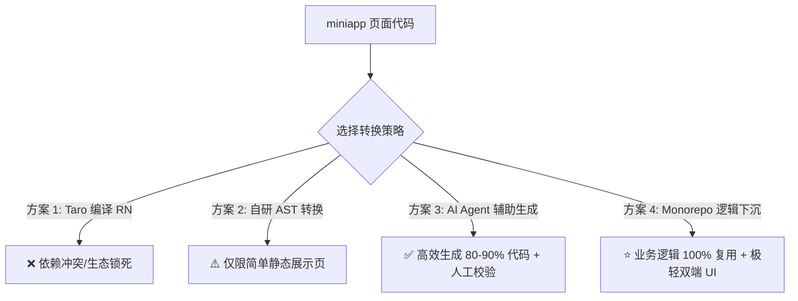

# 小程序 (Miniapp) 页面映射生成 React Native / 鸿蒙 (RNOH) 可行性分析与落地指南

> 本文针对本项目（`apps/miniapp` + `apps/rnoh-app` + `packages/shared`）架构，深入分析从「小程序页面」映射生成「RN 跨端 / 鸿蒙应用页面」的现实可行性、技术难点、方案对比与推荐最佳实践。

---

## 目录

- [一、核心结论速览](#一核心结论速览)
- [二、为什么“100% 全自动 AST/编译映射”难以落地？](#二为什么100-全自动-ast编译映射难以落地)
  - [1. 样式系统的本质代差](#1-样式系统的本质代差)
  - [2. 组件规范与事件模型不对等](#2-组件规范与事件模型不对等)
  - [3. 路由机制与页面生命周期冲突](#3-路由机制与页面生命周期冲突)
  - [4. 双向维护覆盖灾难（Round-trip Problem）](#4-双向维护覆盖灾难round-trip-problem)
- [三、四大技术方案横向对比](#三四大技术方案横向对比)
- [四、多端映射要素对照速查表](#四多端映射要素对照速查表)
- [五、本项目推荐的最佳落地工作流](#五本项目推荐的最佳落地工作流)
  - [步骤 1：业务逻辑与数据契约 100% 下沉](#步骤-1业务逻辑与数据契约-100-下沉)
  - [步骤 2：在 miniapp 端快速完成功能迭代与后端联调](#步骤-2在-miniapp-端快速完成功能迭代与后端联调)
  - [步骤 3：借助 AI 辅助生成 rnoh-app 页面结构](#步骤-3借助-ai-辅助生成-rnoh-app-页面结构)
  - [步骤 4：在 RNOH 原生/鸿蒙端微调与专项验收](#步骤-4在-rnoh-原生鸿蒙端微调与专项验收)
- [六、总结与建议](#六总结与建议)

---

## 一、核心结论速览

| 目标形态 | 现实可行性 | 投入产出比 (ROI) | 说明 |
| :--- | :---: | :---: | :--- |
| **全自动 100% 规则编译器 / AST 转译** | ❌ **极低** | 极低 | 维护庞大转译规则库的成本远超过编写两套 UI 视图层。 |
| **Taro 官方多端编译 (`taro build --type rn`)** | ❌ **不现实** | 极低 | 当前 `rnoh-app` 为 RN 0.82 + RNOH (C-API)，与 Taro RN 运行时强冲突。 |
| **AI 驱动的页面级代码映射与生成** | ✅ **极高** | 极高 | 生成 80%~90% 可用代码，人工仅需 10%~20% 微调与校验。 |
| **架构级逻辑下沉 + 视图层轻量化（当前规范）** | ⭐ **最佳方案** | 最高 | 逻辑在 `@app/shared` 100% 复用，双端各自发挥原生 UI 最佳性能与体验。 |

---

## 二、为什么“100% 全自动 AST/编译映射”难以落地？

虽然 `apps/miniapp`（Taro 4 + React 18）与 `apps/rnoh-app`（React Native 0.82 + React 19 + RNOH）均采用 React/TSX 语法，但底层体系存在显著差异：

```
┌───────────────────────────────────────┐         ┌───────────────────────────────────────┐
│         apps/miniapp (Taro 4)         │         │        apps/rnoh-app (RN 0.82)        │
├───────────────────────────────────────┤         ├───────────────────────────────────────┤
│ • 渲染底座: WebView / 小程序宿主环境   │         │ • 渲染底座: Yoga Flexbox + 鸿蒙 C-API  │
│ • 样式系统: Sass / CSS 选择器 / rpx   │   ≠     │ • 样式系统: NativeWind / StyleSheet   │
│ • 路由系统: Taro 页面栈 (URL Query)   │         │ • 路由系统: React Navigation 7 (Stack)│
│ • 事件模型: onClick / e.detail        │         │ • 事件模型: onPress / nativeEvent     │
│ • 平台生态: 微信专属 API / 标签       │         │ • 平台生态: @react-native-ohos/*      │
└───────────────────────────────────────┘         └───────────────────────────────────────┘
```

### 1. 样式系统的本质代差
* **小程序的 Web/CSS 思维**：
  * 支持完整的 CSS 选择器（如 `& > div`、`:nth-child`、伪类 `:after` 等）。
  * 默认 `display: block`，支持百分比高宽、`rpx` 响应式单位、`100vh` 等。
* **RN / RNOH 的 Yoga 布局引擎**：
  * 只支持 Flexbox 子集（默认 `flexDirection: 'column'`）。
  * **所有文本内容必须包裹在 `<Text>` 组件内**，普通 `<View>` 内放裸字符串会直接崩溃。
  * 不支持样式继承、大部分复合选择器与复杂 CSS 布局属性。直接自动映射容易出现布局坍塌或文字丢失。

### 2. 组件规范与事件模型不对等
* 小程序中的 `<Button onClick={...}>`，在 RN 中通常需要根据平台体验选择 `<TouchableOpacity>`、`<Pressable>` 或 `@ant-design/react-native` 组件。
* 事件回调结构不同：小程序事件通常挂在 `e.detail.value` 下，而 RN 文本输入 `onChangeText` 直接传递字符串值，手势事件由 `react-native-gesture-handler` 提供。

### 3. 路由机制与页面生命周期冲突
* 小程序通过 `app.config.ts` 集中注册页面，跳转使用 `Taro.navigateTo({ url: '/pages/detail/index?id=123' })`。
* `rnoh-app` 采用 React Navigation，具备类型严谨的导航树（`RootStackParamList`）和嵌套结构（`navigation.navigate('Detail', { id: 123 })`），且页面生命周期依赖 `useFocusEffect`。

### 4. 双向维护覆盖灾难（Round-trip Problem）
如果采用自动生成脚本：
1. 脚本将 miniapp 转换为 RN 页面；
2. 开发者为了适配鸿蒙全面屏避让、手势冲突或特定动画，在 RN 页面中修了若干原生特有代码；
3. 下一次 miniapp 修改后再次执行映射脚本，**RN 端的专属修改将被直接覆盖**，造成双向同步灾难。

---

## 三、四大技术方案横向对比



### 1. Taro 官方多端构建 (`taro build --type rn`)
* **原理**：依赖 `@tarojs/rn-runner` 编译输出 RN 工程。
* **致命缺陷**：Taro 的 RN 构建底层与特定的 RN 运行时强绑定。而当前项目的 `apps/rnoh-app` 是深度定制的 **React Native 0.82 + RNOH (HarmonyOS C-API)** 工程，拥有全套 `@react-native-ohos/*` 原生依赖和 NativeWind 4 配置。Taro 编译出的工程无法平滑对齐这套现代鸿蒙工程体系。

### 2. 自研 AST / Babel 转译脚本
* **原理**：编写 Babel 插件 / AST 解析器，把 Taro 标签、Sass 类名、`Taro.navigateTo` 等批量正则/AST 替换为 RN 组件。
* **适用场景**：仅适用于极其标准的简单列表或纯文本展示页面。
* **缺陷**：遇到弹窗、交互动画、下拉刷新、条件渲染时，规则库维护成本呈指数级上升。

### 3. AI Agent 辅助单向生成（推荐 ⭐⭐⭐）
* **原理**：基于标准化 Prompt 和项目规范，将写好的 miniapp TSX + SCSS 页面作为输入，由 AI 自动转换为符合 `rnoh-app` 规范（NativeWind 4 / React Navigation / `@app/shared`）的 React Native 页面。
* **优势**：
  * 具备语义理解能力，能自动将 CSS 样式转换为 Tailwind 类名。
  * 自动补齐 Safe Area、`<Text>` 嵌套和 React Navigation 路由参数类型。
  * 作为开发者的辅助工具，**生成 80%~90% 的可用代码，人工仅需 5~10 分钟做最终校验**。

### 4. Monorepo 逻辑共享 + 极轻 UI 层（架构标准 ⭐⭐⭐⭐⭐）
* **原理**：贯彻本项目在 `README.md` 中确立的原则：**「UI 各自为政，业务下沉共享」**。
* **优势**：
  * 业务服务（`services`）、状态（`slices`）、类型（`types`）在 `@app/shared` 共享。
  * 业务页面只剩下几十行的纯 JSX 渲染，编写成本本就极低，同时确保两端都能获得最佳的用户体验与性能。

---

## 四、多端映射要素对照速查表

在进行页面映射或 AI 辅助转译时，遵循以下要素映射规范：

| 维度 | `apps/miniapp` (Taro 4) | `apps/rnoh-app` (RN / RNOH) | 映射说明 |
| :--- | :--- | :--- | :--- |
| **基础容器** | `<View className="box">` | `<View className="box">` | 样式使用 NativeWind/TailwindCSS |
| **文本渲染** | `<Text>内容</Text>` 或直接文本 | `<Text className="...">内容</Text>` | **RN 中文字必须用 `<Text>` 包裹** |
| **可点击元素** | `<Button onClick={fn}>` | `<TouchableOpacity onPress={fn}>` | 或使用 Ant Design Mobile RN Button |
| **图片展示** | `<Image src="..." mode="aspectFill" />` | `<Image source={{uri: '...'}} resizeMode="cover" />` | RN 区分本地 `require` 与远程 URI |
| **长列表** | `<ScrollView>` / `<View>` map | `<FlashList>` / `<FlatList>` | 推荐使用 Shopify FlashList 保证鸿蒙性能 |
| **页面路由** | `Taro.navigateTo({ url: '/pages/detail?id=1' })` | `navigation.navigate('Detail', { id: '1' })` | 使用 React Navigation 类型化路由 |
| **安全区域** | 自定义 CSS / `env(safe-area-inset-bottom)` | `useSafeAreaInsets()` / `<SafeAreaView>` | 适配鸿蒙/iOS 异形屏与手势导航条 |
| **业务请求** | `createBaseService(miniappHttp)` | `createBaseService(rnohHttp)` | **100% 复用 `@app/shared` 业务契约** |
| **状态管理** | `useAppSelector` / `useAppDispatch` | `useAppSelector` / `useAppDispatch` | **100% 复用 `@app/shared` Store Slices** |

---

## 五、本项目推荐的最佳落地工作流

```
┌────────────────────────────────────────────────────────┐
│ 1. 业务逻辑下沉 (packages/shared)                       │
│    - 定义 TS 类型 (src/types)                           │
│    - 编写 API 服务 (src/services)                       │
│    - 编写 Redux Slices (src/store)                      │
└──────────────────────────┬─────────────────────────────┘
                           │
             ┌─────────────┴─────────────┐
             ▼                           ▼
┌─────────────────────────┐ ┌─────────────────────────┐
│ 2. miniapp 快速迭代      │ │ 3. AI 辅助生成骨架代码  │
│    - 编写 Taro 页面 UI  │─┼─► 转换 TSX 与样式      │
│    - 验证业务流程与接口 │ │    生成 rnoh 页面草稿   │
└─────────────────────────┘ └───────────┬─────────────┘
                                        │
                                        ▼
                            ┌─────────────────────────┐
                            │ 4. rnoh-app 原生校验     │
                            │    - 调整 NativeWind 类名│
                            │    - 适配 Safe Area/动画 │
                            │    - 鸿蒙真机运行验收    │
                            └─────────────────────────┘
```

### 步骤 1：业务逻辑与数据契约 100% 下沉
* 在 [packages/shared/src](file:///Users/dylan/CodeHub/HanTian/hantian-app/packages/shared/src) 中定义数据结构与业务接口。
* 编写平台无关的数据处理 Hook（如 `useGoodsList()`）。

### 步骤 2：在 miniapp 端快速完成功能迭代与后端联调
* 在小程序端通过组件调用 `@app/shared` 完成原型与业务逻辑联调。

### 步骤 3：借助 AI 辅助生成 rnoh-app 页面结构
* 将 miniapp 页面代码输入给 AI 助手，附带项目规范，生成目标 Screen：
  * 将 Sass 转换为 Tailwind 类名（NativeWind）；
  * 将 `Taro` 路由替换为 `useNavigation()`；
  * 自动引入 `@app/shared` 的相同 Service / Reducer。

### 步骤 4：在 RNOH 原生/鸿蒙端微调与专项验收
* 在 `apps/rnoh-app` 中注册路由。
* 对鸿蒙端特定的渲染细节（如字体缩放、物理返回键处理、原生手势）做 10% 左右的轻量调优。

---

## 六、总结与建议

1. **放弃“绝对全自动”的执念**：跨端框架（Web/小程序模型 vs 原生/鸿蒙 C-API 模型）之间的渲染差异决定了 100% 自动编译注定充满边缘 Case 与维护陷阱。
2. **坚持“逻辑最大化共享”**：将网络请求、状态管理、数据契约下沉到 `@app/shared`，让双端只写“纯 UI”，工作量已经减少了 60% 以上。
3. **拥抱“AI 辅助代码映射”**：利用 AI 自动生成页面骨架 + 人工验收，实现效率与原生性能兼得的最优解。
